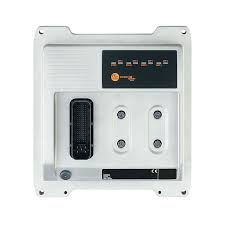
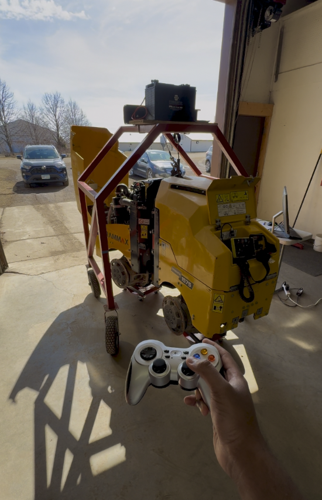

#Industrial Machine Teleoperation Using ROS 2 & an IFM PLC

This repository demonstrates how to connect industrial machinery (such as a trench roller) to ROS 2 using an IFM PLC controller. It provides two Python nodes:

-   **`joy_teleop_node.py`**: Converts joystick inputs into velocity commands.
-   **`tcp_handler_node.py`**: Sends those commands (speed and steering) to the IFM PLC via TCP.

---

## Table of Contents

1.  [Overview](#overview)
2.  [Repository Structure](#repository-structure)
3.  [Hardware Overview](#hardware-overview)
4.  [Nodes Overview](#nodes-overview)
    -   [joy_teleop_node.py](#1-joy_teleop_nodepy)
    -   [tcp_handler_node.py](#2-tcp_handler_nodepy)
5.  [Demo Video](#demo-video)
6.  [Installation & Build](#installation--build)
7.  [Usage](#usage)
8.  [Configuration](#configuration)
9.  [Troubleshooting](#troubleshooting)
10. [License & Contributing](#license--contributing)
11. [Contact](#contact)

---

## Overview

-   **Goal**: Control a trench roller’s throttle and steering through an IFM PLC, using ROS 2 and a joystick.
-   **Key Features**:
    -   Joystick-based speed and steering control.
    -   Gear shifting (adjustable speed/current levels).
    -   Brake toggle via a button.
    -   TCP-based command interface to the IFM PLC.

---


---

## Hardware Overview

1.  **IFM PLC Controller**

    <p align="center">
        
    </p>

    -   Acts as a TCP server receiving commands from ROS.

2.  **Trench Roller**

    <p align="center">
        
    </p>

    -   Movement commands (speed & steering) are executed through the IFM PLC outputs.

3.  **Joystick**

    -   Any standard USB gamepad or joystick is used to provide input to the teleoperation node.

---

## Nodes Overview

### 1. `joy_teleop_node.py`

-   **Subscribed Topic**: `/joy` (`sensor_msgs/Joy`)
-   **Published Topic**: `/cmd_vel` (`geometry_msgs/Twist`)
-   **Function**:
    -   Reads joystick axes/buttons to determine:
        -   *Speed* (linear.x) in mA (e.g. 400 mA, 800 mA, 1100 mA)
        -   *Steering Angle* (angular.z) in degrees (−90° to +90°)
        -   *Gear Shifts* (buttons 4 & 5 to change speed “gears”)
    -   Publishes the resulting velocity commands to `/cmd_vel`.

### 2. `tcp_handler_node.py`

-   **Subscribed Topics**:
    -   `/joy` (for brake toggle via button 0)
    -   `/cmd_vel` (speed & steering commands)
-   **TCP**: Connects to the IFM PLC (default `192.168.82.247:17123`)
-   **Function**:
    -   Toggles “brake” output (OUT0002) via joystick button 0.
    -   Sends speed commands (`SPEED=...`, `REV_SPEED=...`) based on `cmd_vel.linear.x`.
    -   Sends steering commands (`OUT0101 ON/OFF`, `OUT0102 ON/OFF`) based on `cmd_vel.angular.z`.
    -   Includes a *steering deadzone* to prevent jitter.

---

## Demo Video

> *Click below to watch a demonstration (or open `docs/video_demo.mp4` locally).*

[](docs/video_demo.mp4)

*(Replace the above link with your own if hosting on YouTube or elsewhere.)*

---

## Installation & Build

1.  **Clone** the repository into your ROS 2 workspace:

    ```bash
    cd ~/ros2_ws/src
    git clone <repository_url> connecting-machinery-with-ros2-ifm-plc
    ```

2.  **Build** the workspace:

    ```bash
    cd ~/ros2_ws
    colcon build
    source install/setup.bash
    ```

3.  **Verify** the build:

    ```bash
    ros2 pkg list | grep ifm
    ```

    You should see `connecting-machinery-with-ros2-ifm-plc` or similar.

---

## Usage

1.  **Run** the Joystick Driver (if not already):

    ```bash
    ros2 run joy joy_node
    ```

    -   Ensure your joystick is plugged in and recognized by your system.

2.  **Start** `joy_teleop_node`:

    ```bash
    source ~/ros2_ws/install/setup.bash
    ros2 run connecting-machinery-with-ros2-ifm-plc joy_teleop_node
    ```

    -   You will see logs about gear changes, speed, and angle in the terminal.

3.  **Start** `tcp_handler_node`:

    ```bash
    source ~/ros2_ws/install/setup.bash
    ros2 run connecting-machinery-with-ros2-ifm-plc tcp_handler_node
    ```

    -   The node will attempt to connect to `192.168.82.247:17123` by default.
    -   Logs will show `Connected to 192.168.82.247:17123`.

4.  **Control** the Trench Roller:

    -   Use Button 0 to toggle the brake on/off.
    -   Use the joystick’s D-pad/axes to move forward/back (Axis 7) and steer (Axis 3).
    -   Watch the console output for speed/steering commands being sent to the IFM PLC.

---

## Configuration

-   **IFM PLC IP/Port**: In `tcp_handler_node.py`, change `self.controller_ip` and `self.controller_port` if needed.
-   **Gear to Current Mapping**: In `joy_teleop_node.py`, edit the dictionary `self.gear_to_mA` if you have different current/speed relationships.
-   **Steering Outputs**: In `tcp_handler_node.py`, adjust the output labels (`OUT0101`, `OUT0102`) if your IFM PLC wiring differs.
-   **Steering Deadzone**: `self.steering_deadzone` in `tcp_handler_node.py` (default 0.2).

---

## Troubleshooting

-   **Failed to connect to the IFM PLC**:
    -   Verify your PC is on the same subnet (e.g., `192.168.82.x`).
    -   Try `ping 192.168.82.247` to confirm connectivity.
-   **No joystick input**:
    -   Check that your joystick is recognized: `ros2 topic echo /joy`.
    -   Install the ROS 2 joystick package: `sudo apt-get install ros-<distro>-joy`.
-   **Brake remains engaged**:
    -   Ensure you toggled Button 0.
    -   Check logs for “Brake ON => …” or “Brake OFF => …” messages.
-   **Incorrect steering direction**:
    -   Adjust the sign of `axis_3` or the on/off commands in `tcp_handler_node.py`.

---

## License & Contributing

-   Licensed under the MIT License.
-   Contributions: Please open an issue or PR for major changes.

---

## Contact

Your Name
Email: your.email@domain.tld

For questions, feedback, or commercial inquiries, feel free to reach out.

Happy automating with ROS 2 and IFM PLCs!
